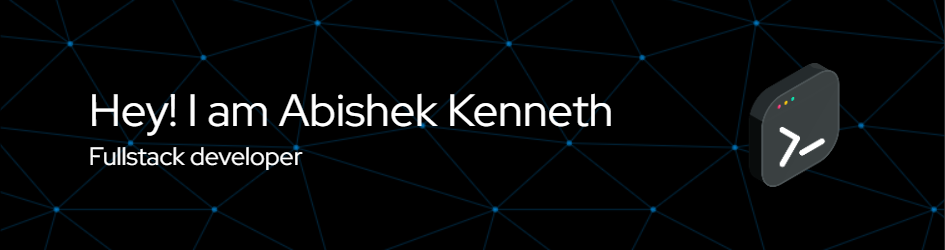

Hello! I’m Abishek Kenneth, a full stack developer with a deep passion for building web applications. I thrive on crafting user-centered solutions using a diverse tech stack that includes HTML, CSS, JavaScript, ReactJS, ViteJS, PostgreSQL, MongoDB, and the MERN/PERN stacks. I love diving into projects that challenge me to experiment with new features and continuously improve. My enthusiasm for learning and innovation drives my development process, always pushing the boundaries of what I can create.

- 🔭 I’m currently working on Chatbot 
- 🌱 I’m currently learning Angular 

        
